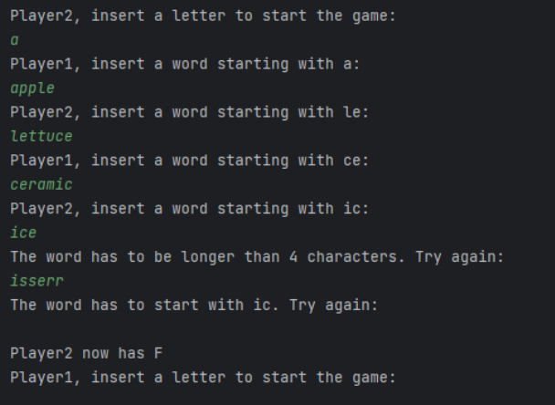

# Fazan - A word chain mini game

Fazan is a word chain game played in 2 or more players. For the sake of this app, we will only use 2 players.

The gameflow is as following:

- First player decides what the starting letter is.
- Second player has to write a word that starts with that letter and is longer than 4 characters.
- First player has to then write a word that starts with the last 2 letters of the previous player's word.

As an example, a starting round looks like this: A->Apple->Lettuce->Ceramic and so on.

When a player enters an empty answer, he will lose the round and lose 1 life point. Each player has 5 life points, after which the game will end.

## Table of content

- [Installation](#installation)
- [Usage](#usage)

## Installation

- Clone the repository

## Usage

!!! Very important, please use only lower case when inserting words/letters. I did not think about the upper letters when I created it :D I will have to adjust it.

1. Open the project using the preferred IDE.
2. Run the main function under FazanGame Class.
3. First player introduces the first letter.
4. Second player continues the game as described in the paragraph above.

Example of 1 round:

